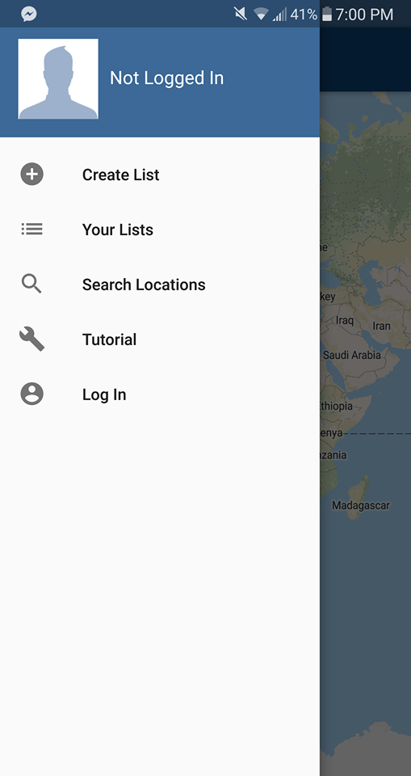
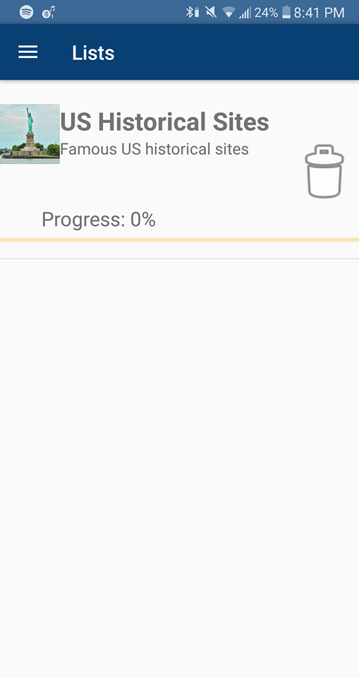
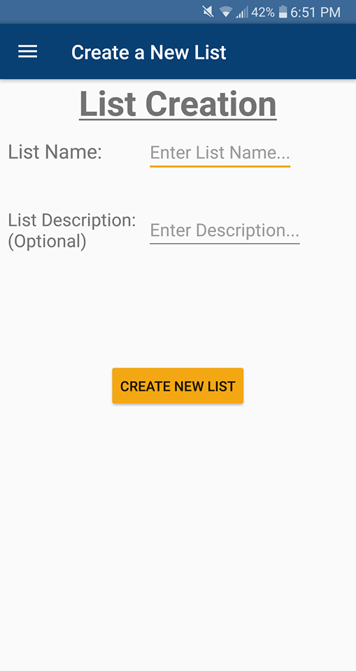
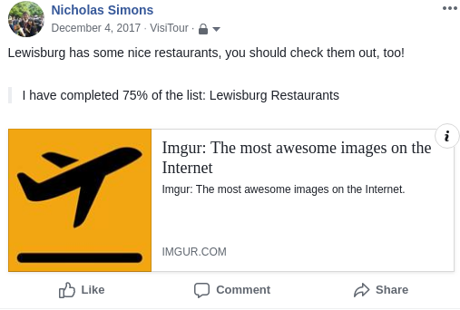

# VisiTour

VisiTour is an Android application for tracking your travels!  Create lists of locations that you would like to visit, then mark your progress as you complete your lists.

## Motivation
Our client, Professor Alan Marchiori of Bucknell University's Department of Computer Science, discovered a void in the market for a travel-tracking mobile application when he was searching for an easy way to track which national parks he had
and had not yet visited.  We built VisiTour to meet the client's wishes for an easy-to-use Android application that enables travel progress tracking with map functionality.  

### Tech

VisiTour was built with the help of:

* [Firebase Database](https://firebase.google.com/) - A backend for storing users' lists and data
* [Firebase Cloud Storage](https://firebase.google.com/docs/storage/) - Used for storing images for each of the default locations provided for every user
* [Google Maps API](https://developers.google.com/maps/documentation/) - Enables users to view and interact with maps through Google's Maps UI  
* [Google Places API](https://developers.google.com/places/web-service/intro) - Provides data about locations that users add to their lists
* [Facebook Login](https://developers.facebook.com/docs/facebook-login/) - Allows users to sign in to VisiTour with their Facebook accounts

### Installation
[Download Visitour](https://goo.gl/y1EbJP) for your Android device from the Google Play Store!

### Usage
When you first open VisiTour, you will be prompted to sign in.  **You will not have access to VisiTour's features until you log in with your Facebook account.**  

To log in, open the navigation drawer by tapping the hamburger button at the top left of the screen.  Tap *Log In* at the bottom of the menu that appears, as shown below.

The navigation drawer allows you to access all of VisiTour's other functions, as well.  First, you may wish to view your lists.  Select *Your Lists* in the navigation bar to do so.  

When you install the app, you will be provided with a default list as an example, shown below.  On this screen, you may view all of your lists as well as progress bars that denote your completion of each list.  You may also delete any list by selecting the trash can icon to its right.  Open any list by clicking its name or image.  

To create your own lists, select *Create List* from the navigation drawer.  On the resulting screen, shown below, you can set a name and description for your new list.  When you've chosen a name and description, select the *CREATE NEW LIST* button to begin adding locations.  

When you've opened a list, you may view the locations saved in it or add new locations, by clicking the **+** button in the bottom right of the screen.  You may mark any location as visited, or delete any location.  By clicking any location in a list, you can open that location on a map powered by Google Maps API.

By selecting the Share button at the bottom right of a list screen, you may share your progress on that list on Facebook.  

Finally, you can use VisiTour to simply find different locations on a map, which may be useful if you need inspiration for list creation.  You can access this feature by selecting *Search Locations* from the navigation drawer.  This functionality is made possible thanks to the Google Maps API and Google Places API.  

### Credits
Contributors:
* Jack Napor
* Nick Simons
* Caroline Whitman

Special thanks to our client, Dr. Alan Marchiori, and our advisor, Dr. Evan Peck.
